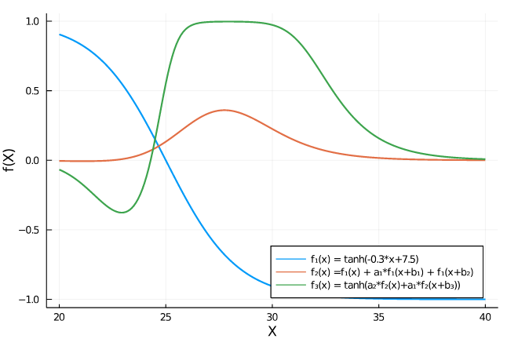
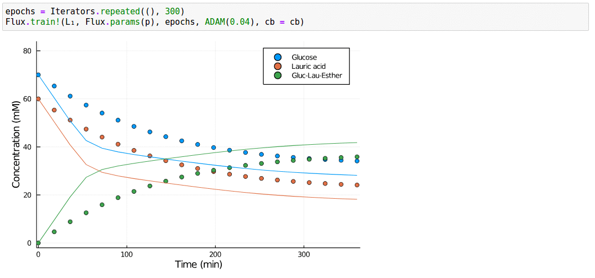
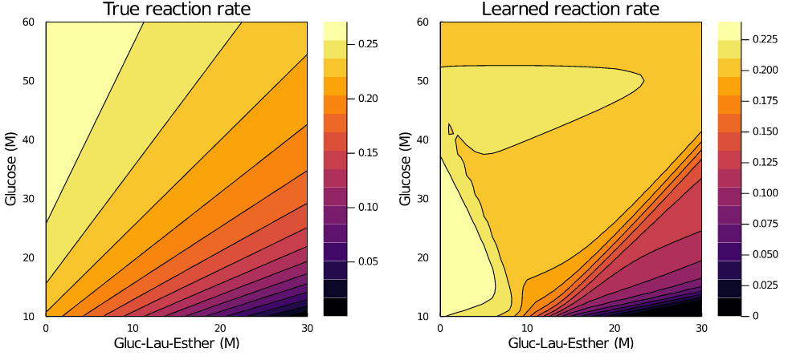

# Workshop-NeuralODE-2020
A 30 minute showcase on the how and the why of neural differential equations. 

## Installation

## Content
There are three julia notebooks that show,

[Notebook 1:](./01-machine-learning.ipynb) an introduction to machine learning and neural networks,

[Notebook 2:](./02-NODEs.ipynb) learning reaction kinetics using neural differential equations (NODEs),

[Notebook 3 (WIP):](./) coupling these NODEs with reactor models.

Contact: [Bram.De.Jaegher@gmail.com](mailto:bram.de.jaegher@gmail.com)

